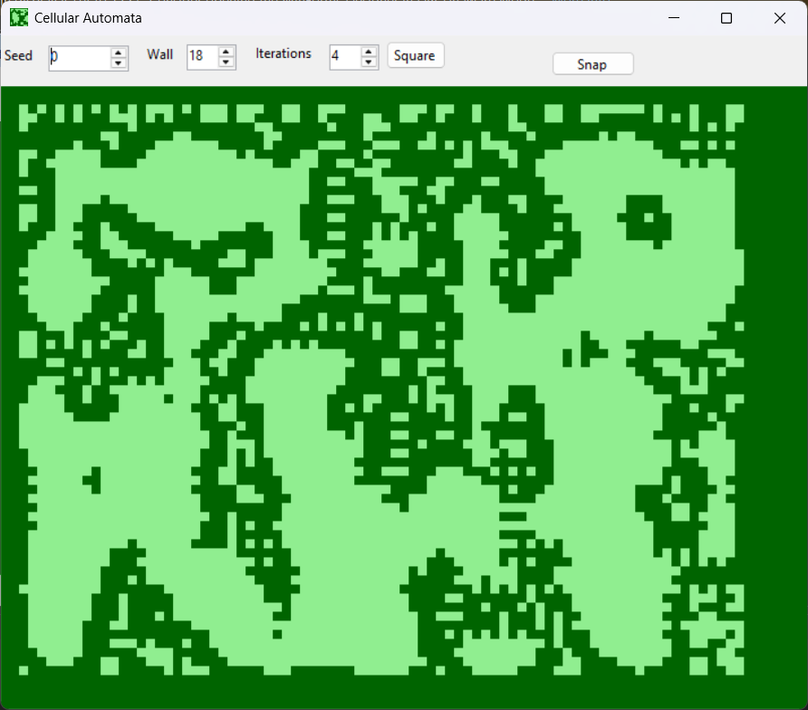

#Cave

"Cave" is a UI for John Conway's cellular-automata. Over the later 1970s this was called The Game Of Life. For us, this carves out caves in green limestone.

##The Code

Although there exist several algos one could use, this app's calculations are for counting adjacent "wall" and adjacent-to-adjacent "wall", from the static functions in <a href='https://www.roguebasin.com/index.php/Cellular_Automata_Method_for_Generating_Random_Cave-Like_Levels'>Rogue Basin</a>. The shared hope is to generate small tiles for dungeon-mapping.

My class overall is not static. Specific steps must be taken:

0. Set the width. This is done in the constructor. (My constructor will then speedrun steps 1-2.)
1. Set the seed, down from which each line of bytes shall generate (randomly). 
2. Set the limit byte of wall, below which each pixel is marked as "true". For human readability this comes in as 0-100 ("per-cent'") rather than 0-255.
3. Iterate however-many times.

With those steps, state can be held.

My UI uses integer scrollers to set the values: seed, percentage-of-wall, and iterations. You can also adjust the height and width. For iterations and window-size, click "Snap" to reset the resolution, going through all four steps noted here.

This logic forced some code-patterns. It stores the box of randomised bytes in memory; also the two-pixel frame of True around the box is in memory. The two-pixel frame is employed: the Elemental Plane Of Air at less than 50%-wall chosen, and Of-Stone more than that. And I have each new line (in y) as an increment to the requested seed; in our y-increases-downward UI, a "top" seed.

You will note as you muck with the program:

* Iterating forward eventually runs into a permanent loop of white-noise.
* Bastions of wall at high iterations depend upon the percentages chosen for the first iteration. The best results come from 60% wall; or 18% wall, as the automata get greedy and immediately flip the field to too much wall too fast. About 38% wall isn't too bad, as islands hold out.
* Iterating forward is fast. Iterating backward amounts to decreasing entropy: the code must redo step-2 and re-iterate to where you want.
* Increasing the wall percentage re-runs the iterations from step-2.
* Resetting the width resets everything so is slowest.
* Changing the seed must change up the box of bytes, so is also slow.
* Changing the seed is a vertical scroll.

Those last two constraints, together, are annoying.

I have mitigated the incremental seed-changes by way of a "BumpSeed" method. This adds the next line to the box of bytes. It then runs a targeted peek at the higher-magnitude lines of bytes. It finally replaces the actual lines with these lines. You will note the seed-bumping will run faster than recalculating all the lines in the display; however, it costs in accuracy. Compare bumping forward (down) to bumping backward (up), for which I wrote no dedicated method.

##The Randomiser

Also provided here is a Mersenne randomiser. Therein lieth a tale.

Microsoft's version descends from Knuth in the earliest 1980s. Now in 2025 I encountered a vertical string of <A href='https://www.youtube.com/watch?v=DwRXI-y6M9o'>whiiiiite liiines</a> (here, green) of wall down certain longitudes. They turned out, no joke, to be the 64th value on the .Next().

For Rogue Basin in their ASCII minicaves, regular north-south patterns were a feature. So I don't blame them, for leaning upon Microsoft's laziness. But equally we are not them. I wanted alternatives.

Immediately suggested was the Mersenne Twister. The 1997 version I found was a 19937-bit run... twisted down for 32-bit machines. So it baked up random UInt32 numbers. I figured the efficient way would be to chop this into an array of eight four-bit nybbles (zero to 127); but I had to content myself with the usual bytes. (Tinkers to my UI may explore higher-resolution percentage inputs.)

I have found on Wikipedia a twister for 64-bit machines, which gets eight bytes at a time. For a change Wiki didn't mess us over, here. I can Array.Copy or Buffer Copy those arrays, without returning to the well those extra seven times.

##VARPTR

The Marsenne original was in C. So, indeed, was Rogue Basin's automata functionpair, at base. The C# translations do not scale to high values, performance-wise. One pain-point was in reading and writing to the arrays.

Let us revert to the C / assembler way: make these classes /unsafe. Then instead of passing the CLR reference to the array, we pass the RAM pointer to the array. The "VARPTR", for those TSR-80 holdouts amongst us.

It is dangerous, as the 1980s were without Protection; but with careful thought and preserving the parameter space, this code does it without bricking my computer.

##Square... or Hexagon

Our computers use square(al) pixels. They don't have to; regular-hexagonal pixels are possible. I have hacked a hexagonal option for this project.

The co-ordinate system, so the hex-orientation, follows Gary Gygax in role playing game modules D1-D2, "Descent into the Depths Of The Earth" (GenCon 1978). That series frequently tops the charts of RP gaming and, also, it fits the late-1970s theme of all this (excepting the randomiser).

I must get out in front that the hex model doesn't look good. Hexes rendered to squares scale poorly to higher iterations, which overrun the resolution of any square-pixel monitor. It follows, I didn't make efficient what wouldn't even display in higher iterations. Less-defencibly in these co-ordinates my map is triangular. I will just say that, like Delta House: it exists.

David Ross
2 September 2025

